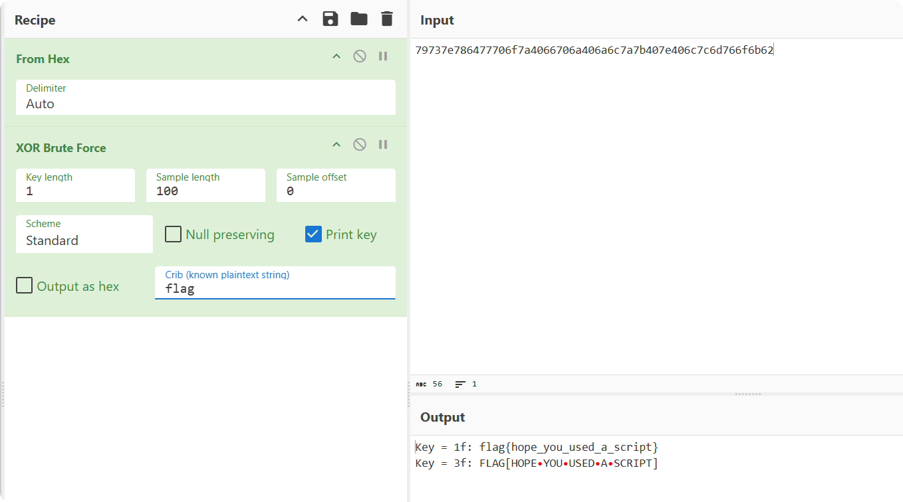

# 编码

## 进制

### 二进制（Binary）

二进制是一种使用两个符号（0 和 1）来表示数据的数制。每个二进制位称为“比特”（bit）。

### 八进制

### 十进制

### 十六进制

十六进制是一种使用十六个符号（0 到 9 和 A 到 F）表示数据的数制。

## ASCII

ASCII（**A**merican **S**tandard **C**ode for **I**nformation **I**nterchange，美国标准信息交换码）是一种字符编码方案。

在计算机中，所有数据存储和运算都使用二进制表示，因计算机通过高电平和低电平分别对应1和0。字母、数字以及常用符号在计算机中也需要使用二进制表示。为确保互通，必须使用统一的编码规则，因此美国标准化组织制定了ASCII编码，规定了常用符号对应的二进制数字。

标准ASCII和扩展ASCII。

## 异或`XOR`

异或（XOR）是一种**位运算符**，符号为 `^`。其规则是：**两个二进制位相同则结果为 0，不同则结果为 1**。

| A | B | A ^ B |
|---|---|-------|
| 0 | 0 |   0   |
| 0 | 1 |   1   |
| 1 | 0 |   1   |
| 1 | 1 |   0   |

异或的性质：

1. 任意数与 0 异或结果为其本身：`A ^ 0 = A`
2. 任意数与自身异或结果为 0：`A ^ A = 0`
3. 异或运算满足交换律和结合律：`A ^ B = B ^ A`，`(A ^ B) ^ C = A ^ (B ^ C)`

### 示例代码

## 例题分析

### 例题-`XOR`

```
79737e786477706f7a4066706a406a6c7a7b407e406c7c6d766f6b62
```

- 题目分析

题目提供了一串十六进制数字，我们知道两个十六进制数字可以表示一个字节。根据题目名称，可以通过暴力破解方式来寻找异或秘钥，以实现解密。

- 解法一

```python
cipher = bytes.fromhex("79737e786477706f7a4066706a406a6c7a7b407e406c7c6d766f6b62")

# 遍历所有可能的单字节密钥（从 0x00 到 0xff）
for i in range(0x00, 0xff):
    result = "".join(chr(i ^ j) for j in cipher)
    if "flag" in result:
        print("Flag found:", result)
```

- 解法二

我们主要使用 [CyberChef](https://gchq.github.io/CyberChef/#recipe=From_Hex('None')XOR_Brute_Force(1,100,0,'Standard',false,true,false,'flag')&input=Nzk3MzdlNzg2NDc3NzA2ZjdhNDA2NjcwNmE0MDZhNmM3YTdiNDA3ZTQwNmM3YzZkNzY2ZjZiNjI) 的`XOR Brute Force`模块，在正确使用该模块之前，需要首先使用`From Hex`功能将提供的字符串转为以两个十六进制数表示的字节数组。



## 字母频率统计

```bash
$ cat flag.txt | fold -w1 | sort | uniq -c | sort -nr
2508 G
   2481 X
   2453 Y
   2301 {
   2221 g
   2087 a
```

- `fold -w1` 将每个字符放在单独的一行。
- `sort` 对字符进行排序。
- `uniq -c` 统计出现次数。
- `sort -nr` 根据出现次数从高到低排序。
