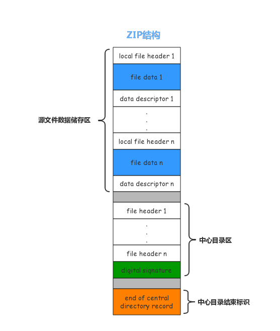

# ZIP压缩包

无损压缩

## ZIP压缩包的格式



压缩方法有
加密算法有传统的`ZipCrypto`和强加密`AES`

## 常见攻击方法

### 修复

### 伪加密

### 暴力破解

#### John the Ripper

```bash
zip2john demo.zip > zip_hash.txt
john zip_hash.txt
```

### 已知明文攻击（Known Plaintext Attack，KPA）

已知明文攻击是一种利用压缩包中部分已知内容来破解加密的技术。  
在 PKZIP 流加密中，如果攻击者能够获得至少 12 字节的已知明文（其中 8 字节必须是连续的），就可以通过已知明文攻击推导出加密密钥，从而解密整个压缩包。

[A known plaintext attack on the PKZIP stream cipher.](https://link.springer.com/chapter/10.1007/3-540-60590-8_12)

<https://github.com/kimci86/bkcrack>

### CRC32 碰撞

## 参考

- <https://medium.com/@felixstridsberg/the-zip-file-format-6c8a160d1c34>

## RAR

### 密码破解

```bash
rar2john -v filename.rar > hashrar
# 字典
john --wordlist=dict hashrar

# 最大长度4的数字
john  --incremental=digits --max-length=4 hashrar
john --min-length=2 --max-length=6 hashrar
```

--incremental：

默认的增量模式，使用所有字符，包括大写字母、小写字母、数字和特殊符号，适合于没有任何密码信息的情况下进行全面的暴力破解。
--incremental=Alphanum：

仅使用字母和数字，既包括大写 (A-Z) 和小写 (a-z) 字母，又包括数字 (0-9) 的增量模式。
--incremental=Lower：

仅使用小写字母 (a-z) 进行密码生成。适合于针对只由小写字母组成的密码。
--incremental=Upper：

仅使用大写字母 (A-Z) 生成密码。
--incremental=Alpha：

包括所有字母，大写和小写 (A-Z, a-z)。
--incremental=All：

包括所有字符，包括字母 (大写 + 小写)、数字和特殊字符。
