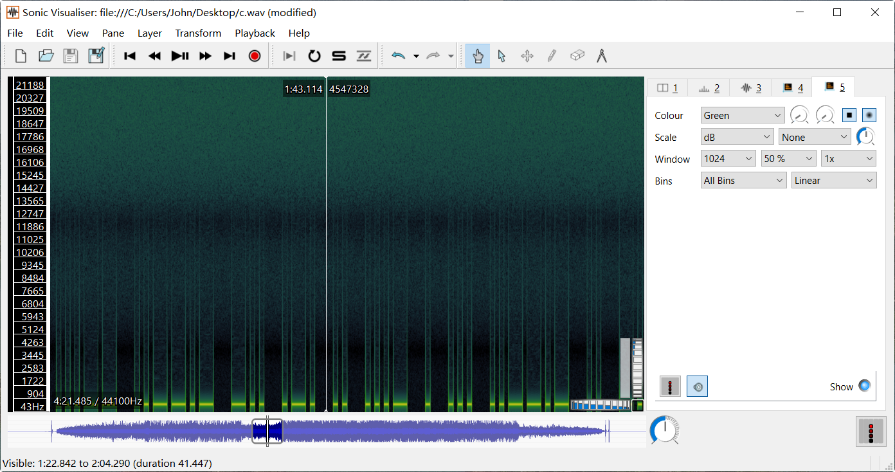

# 音频隐写

常见的音频文件类型有`MP3`和`WAV`。

- WAV
  - 是一种无损音频格式，通常使用 PCM（脉冲编码调制）进行编码。
  - 文件大小较大，因为它包含完整的未压缩音频数据。
- MP3
  - 是一种有损音频格式，通过压缩算法去除人耳不易察觉的音频数据，使文件更小。
- FLAC
Sonic Visualiser

<https://deepsound.en.uptodown.com/windows>

## 波形图隐写

### 例题分析：a

### 例题分析：[SCTF 2021]in_the_vaporwaves

中间部分音频左右声道反相，尝试将左右声道合并。

```python
import wave

output_file = "output.wav"

with wave.open("c.wav", "rb") as wav_file:
    # 获取音频参数
    params = wav_file.getparams()
    num_channels, sample_width, frame_rate, num_frames = params[:4]

    # 输出音频参数
    print(f"声道数: {num_channels}")
    print(f"样本宽度: {sample_width} 字节")
    print(f"采样率: {frame_rate} Hz")
    print(f"帧数: {num_frames}")

    # 读取所有音频数据
    audio_data = wav_file.readframes(num_frames)

# 收集所有混合后的采样点
mixed_data = bytearray()

for i in range(num_frames):
    # 计算每个采样点的起始位置
    start = i * num_channels * sample_width
    # 计算每个采样点的结束位置
    end = start + sample_width

    # 提取左声道和右声道数据
    left_channel = audio_data[start:end]
    right_channel = audio_data[start + sample_width : end + sample_width]

    # 处理单声道文件时，右声道可能不存在
    if len(right_channel) < sample_width:
        right_channel = left_channel

    # 将左声道和右声道数据混合为单声道
    mixed_channel = (
        int.from_bytes(left_channel, "little", signed=True)
        + int.from_bytes(right_channel, "little", signed=True)
    ) // 2
    # 转回字节
    mixed_bytes = mixed_channel.to_bytes(sample_width, "little", signed=True)
    mixed_data.extend(mixed_bytes)

# 写入新的WAV文件
with wave.open(output_file, "wb") as f:
    f.setnchannels(1)  # 设置为单声道
    f.setsampwidth(sample_width)
    f.setframerate(frame_rate)

    f.writeframes(mixed_data)

print("单声道WAV文件已生成：", output_file)
```

打开`output.wav`，提取摩尔斯电码。


```
... -.-. - ..-. -.. . ... .---- .-. ...-- ..--.- -.. .-. .. ...- . ... ..--.- .. -. - ----- ..--.- ...- .- .--. --- .-. .-- .--.-. ...- . ...
```

在[CyberChef](https://gchq.github.io/CyberChef/#recipe=From_Morse_Code('Space','Line%20feed')&input=Li4uIC0uLS4gLSAuLi0uIC0uLiAuIC4uLiAuLS0tLSAuLS4gLi4uLS0gLi4tLS4tIC0uLiAuLS4gLi4gLi4uLSAuIC4uLiAuLi0tLi0gLi4gLS4gLSAtLS0tLSAuLi0tLi0gLi4uLSAuLSAuLS0uIC0tLSAuLS4gLi0tIC4tLS4tLiAuLi4tIC4gLi4u)上解码即可。

方法二：

- `Audacity`

点击菜单栏`轨道`>`混音`>`混合立体声至单声道`。


合并为单声道，结果如下图所示：


- `Sonic Visualiser`

点击菜单栏`Layer（图层）`>`Add Spectrogram（添加频谱图）`>`All Channels Mixed（所有声道混合）`，将所有声道的频谱数据混合成一个单一的频谱图。



## 频谱图

## LSB

### `MP33stego`

[MP3stego](https://www.petitcolas.net/steganography/mp3stego/)

## 工具

[WAV]

[Steghide]

[AudioStego](https://github.com/danielcardeenas/AudioStego)

- [Audacity](https://www.audacityteam.org/download/windows/)
- [sonic visualiser](https://www.sonicvisualiser.org/)
