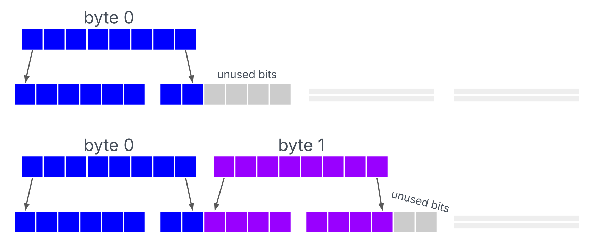

# 其他隐写

## Base64 隐写



在编码过程中，未使用的比特位可以被修改而不影响解码，从而实现信息隐藏。出题时，通常会提供许多 Base64 片段。

### 例题1：[Olympic 2014] Find da Key

附件：[stego.txt](https://shell-storm.org/repo/CTF/Olympic-2014/Find_da_Key/stego.txt)

```python
# -*- coding: utf-8 -*-
#!/usr/bin/env python

import base64


def get_base64_diff_value(s1, s2):
    # Base64 字符集
    base64chars = "ABCDEFGHIJKLMNOPQRSTUVWXYZabcdefghijklmnopqrstuvwxyz0123456789+/"

    for i in range(len(s1) - 1, -1, -1):
        # 从后向前比较两个字符串同一位置上的字符
        if s1[i] != s2[i]:
            # 如果不同，返回两者在 base64chars 中索引的绝对差值
            return abs(base64chars.index(s1[i]) - base64chars.index(s2[i]))

    return 0  # 如果没有不同的字符，返回 0


def solve_stego():
    # 打开并读取 'stego.txt' 文件
    with open("stego.txt", "rb") as f:
        file_lines = f.readlines()

    bin_str = ""
    for line in file_lines:
        steg_line = line.decode().strip()  # 解码并去除换行符
        # 先解码再编码每一行，以获得规范的Base64编码行
        norm_line = base64.b64encode(base64.b64decode(steg_line)).decode().strip()

        # 获取两个Base64字符串之间的差异值
        diff = get_base64_diff_value(steg_line, norm_line)
        # 统计填充字符 '=' 的数量
        pads_num = steg_line.count("=")

        if diff:  # 如果有差异
            # 将差异值转换为二进制并根据填充数量填充0
            bin_str += bin(diff)[2:].zfill(pads_num * 2)
        else:  # 如果没有差异
            # 根据填充数量添加对应数量的0
            bin_str += "0" * (pads_num * 2)

    res_str = ""  # 初始化结果字符串
    for i in range(0, len(bin_str), 8):
        # 每8位转换为一个字符
        res_str += chr(int(bin_str[i : i + 8], 2))

    print(res_str)  # 打印提取的隐写信息


# 执行隐写提取函数
solve_stego()

```

### 参考资料

- <https://hexarcana.ch/b/2024-08-16-base64-beyond-encoding/>
- <https://www.tr0y.wang/2017/06/14/Base64steg/>
- <https://delimitry.blogspot.com/2014/02/olympic-ctf-2014-find-da-key-writeup.html>
- <https://github.com/FrancoisCapon/Base64SteganographyTools>

## NTFS 交换数据流隐写

NTFS（New Technology File System）是微软公司开发的一种文件系统，广泛应用于 Windows 操作系统。与早期的文件系统（如 FAT32）相比，支持访问控制列表（ACL）、支持扩展文件属性和数据流（如交换数据流）等等。

交换数据流（Alternate Data Streams, ADS） 是 NTFS 文件系统的一种高级特性，允许一个文件存储多个数据流。除了默认的数据流（文件的主体内容），用户可以创建附加的数据流，从而在一个文件中存储不同的信息。数据流使用 `filename:streamname` 的格式表示。例如，文件 `example.txt` 可以有一个名为 `secret` 的数据流，表示为：

- 创建数据流

```cmd
echo "hello world!" > example.txt:secret
```

- 查询数据流

在`cmd`下使用`dir /R`命令可查看交换数据流。

- 读取数据流

```
notepad example.txt:secret
```

常用工具如下：

- NTFS ADS Scanner

## Whitespace隐写

## `.pyc`隐写
